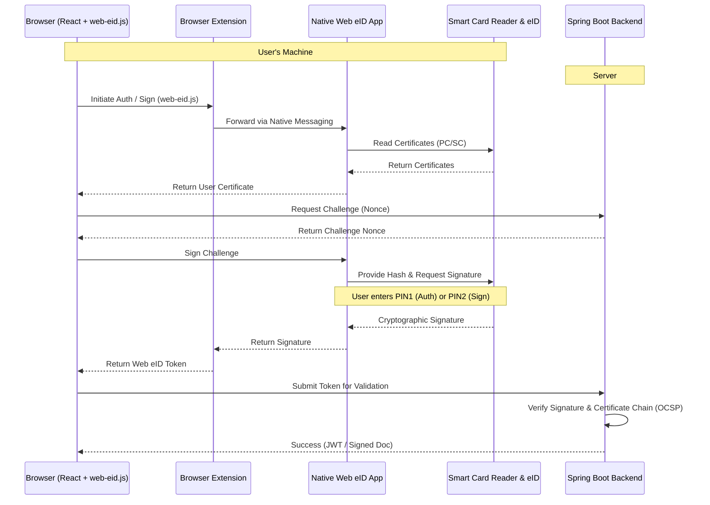

# Executive Summary & Architecture

## 1. Executive Summary

### What is Web eID?
Web eID is a system that enables secure authentication and digital signing with European Union electronic identity (eID) smart cards in web applications.

### What problem it solves
Browsers cannot directly communicate with smart cards due to security sandboxing. Web eID provides a secure bridge between the web application in the browser and the native smart card drivers on the user's operating system, allowing cryptographic operations to be performed using the eID card without exposing the private keys.

### Responsibilities

*   **Browser (React Frontend)**: Uses the `web-eid.js` library to initiate communication with the Web eID extension. It acts as a middleman, passing challenges from the backend to the extension and returning the generated signatures/tokens back to the backend.
*   **Web eID Extension**: A browser extension that intercepts requests from the webpage and forwards them to the native Web eID client application via Native Messaging.
*   **Web eID Client (Native App)**: Communicates with the smart card reader (via PC/SC / PKCS#11). It displays the UI for PIN entry and executes the cryptographic operations on the smart card.
*   **Smart Card**: securely stores the user's X.509 certificates and private keys. It performs the actual cryptographic signing when provided with the correct PIN. The private keys *never* leave the card.
*   **Backend (Spring Boot)**: Generates secure challenge nonces, validates the authentication tokens (signatures) returned by the client against the user's public certificate, performs certificate validation (OCSP, Trust chain), and handles session creation by issuing JSON Web Tokens (JWT). For document signing, it prepares the data hash, verifies the signature, and constructs the final signed document container (e.g., ASiC-E).

## 2. Web eID Architecture

The system operates across three distinct security domains: the web server (backend), the web browser (frontend), and the user's operating system (native app and smart card).

### References
*   [Web eID System Architecture Document](https://github.com/web-eid/web-eid-system-architecture-doc)
*   [Web eID Official Website](https://web-eid.eu/)
