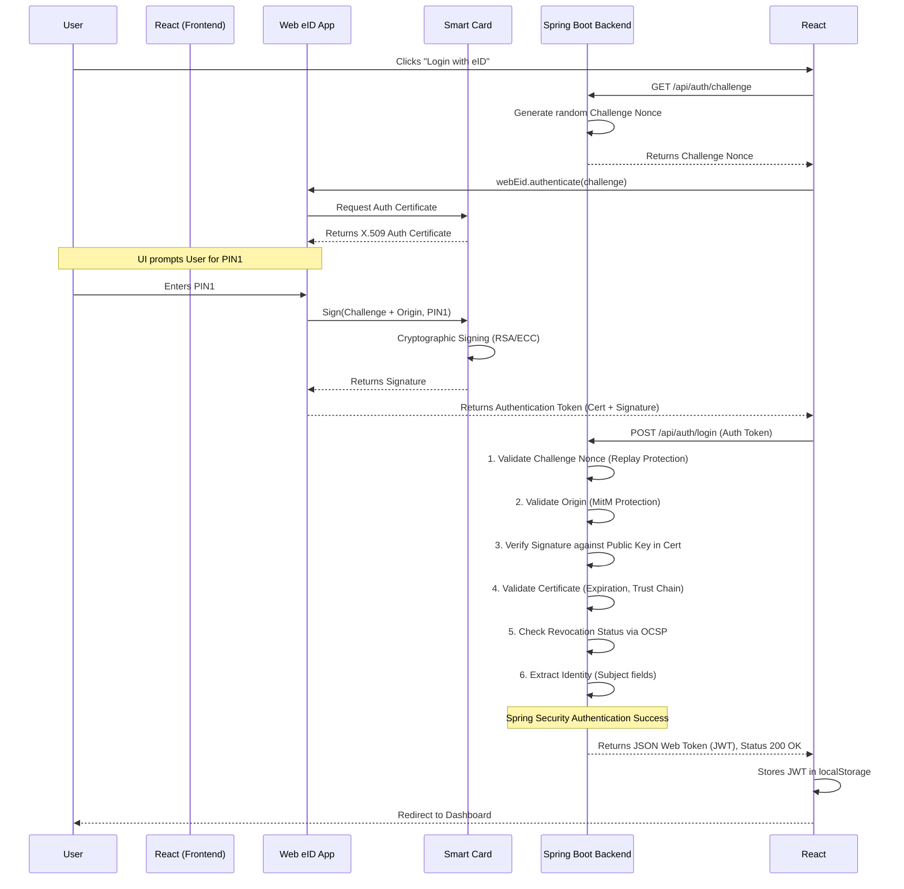

# Authentication Workflow

## Overview
Web eID authentication relies on asymmetric cryptography (Public Key Infrastructure - PKI). The user's smart card contains a private key for authentication and a corresponding public key embedded in an X.509 certificate.

The authentication process verifies that the user currently possesses the physical smart card and knows the authentication PIN (PIN1). It does this by asking the smart card to sign a securely generated, random challenge nonce.

## Sequence Diagram

## Step-by-Step Details

1.  **Challenge Generation**: The frontend requests a challenge nonce from the backend. The backend securely generates a large random number (nonce) and stores it temporarily (e.g., in an in-memory cache tied to an anonymous pre-session or via a signed cookie). This is crucial for **preventing replay attacks**. The nonce is short-lived (e.g., 5 minutes).
2.  **Web eID Invocation**: The frontend calls the `web-eid.js` library, passing the challenge nonce. The library communicates with the native app via the browser extension.
3.  **Certificate Reading**: The native app connects to the smart card reader and reads the user's authentication certificate.
4.  **PIN Entry**: The native app displays a dialog asking the user to enter their PIN1 (authentication PIN).
5.  **Cryptographic Signature**: The native app instructs the smart card to sign the challenge nonce (combined with the browser's origin) using the private key protected by PIN1.
6.  **Token Submission**: The native app returns a Web eID Authentication Token to the frontend. This token contains the generated signature, the user's certificate, and metadata. The frontend sends this token to the backend's login endpoint.
7.  **Backend Validation (The Core Security Check)**: The backend uses the `web-eid-authtoken-validation-java` library to perform rigorous checks:
    *   **Nonce Check**: Ensures the token's challenge matches the one issued and hasn't been used before.
    *   **Origin Check**: Verifies the origin in the token matches the expected server URL.
    *   **Signature Verification**: Uses the public key inside the provided certificate to mathematically verify the signature was created by the corresponding private key.
    *   **Certificate Validation**: Checks if the certificate is within its validity period and chains up to a trusted Root CA.
    *   **OCSP Check**: Contacts the Online Certificate Status Protocol (OCSP) responder of the Certificate Authority to ensure the certificate hasn't been revoked (e.g., if the card was lost/stolen).
8.  **JWT Issuance**: If all checks pass, the backend extracts the user's identity from the certificate (e.g., Subject field containing Name and Personal Code). It then generates a JSON Web Token (JWT) containing the user's identity and roles, signs it with a secret key, and returns it to the frontend.
9.  **Session Establishment**: The frontend stores the JWT and includes it in the `Authorization: Bearer <token>` header for all subsequent API requests. The backend validates the JWT on each request, ensuring stateless authentication.

### References
*   [Web eID Authentication Protocol](https://github.com/web-eid/web-eid-system-architecture-doc#authentication)
*   [Java Auth Token Validator](https://github.com/web-eid/web-eid-authtoken-validation-java)
