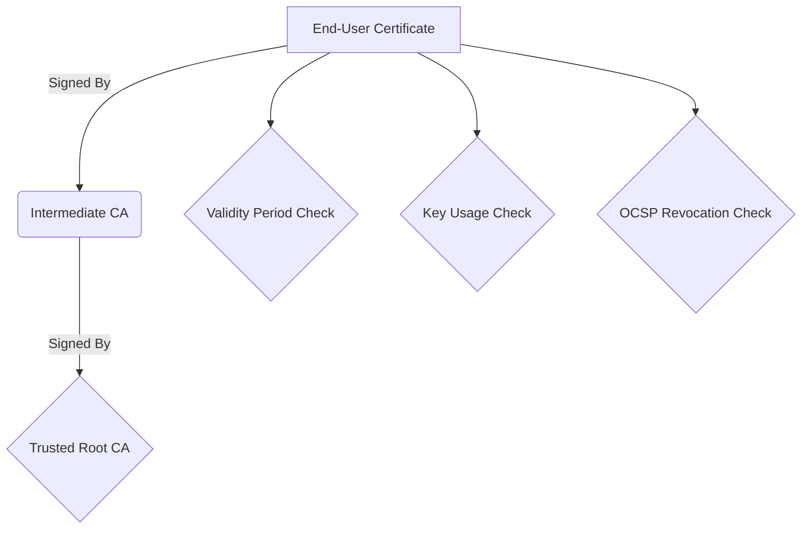

# Certificate Validation

## Overview

A digital signature is useless unless the certificate of the signer is thoroughly validated. In Web eID, this validation occurs on the backend during both authentication and document signing.

## The Validation Chain



## 1. Certificate Chain of Trust

When a user submits an authentication token, the backend receives their X.509 certificate.
*   The backend looks at the `Issuer` field of the user's certificate.
*   It attempts to build a path from the user's certificate up to a configured **Trusted Root Certificate Authority (Root CA)**.
*   If the chain cannot be built, or if the root is not explicitly trusted by the backend's configuration, authentication fails. This prevents attackers from simply generating their own fake eID certificates.

## 2. Validity Period

Every certificate has a `Not Before` and `Not After` date.
*   The backend verifies that the current server time falls strictly within this window.

## 3. Key Usage (KU) and Extended Key Usage (EKU)

eID cards typically contain two separate certificates: one for authentication, one for signing.
*   **Authentication Validation**: The backend checks that the `Key Usage` extension includes `Digital Signature` and the `Extended Key Usage` includes `Client Authentication` (OID 1.3.6.1.5.5.7.3.2).
*   **Signing Validation**: The backend checks that the `Key Usage` strictly includes `Non-Repudiation` (or `Content Commitment`). You cannot use an auth certificate to sign legally binding documents.

## 4. Revocation Checking (OCSP)

A certificate might be within its validity period but compromised (e.g., the user lost their smart card).
*   **OCSP (Online Certificate Status Protocol)**: The backend MUST contact the CA's OCSP responder URL (usually found in the `Authority Information Access` extension of the certificate) in real-time.
*   The backend sends the serial number of the user's certificate.
*   The OCSP responder replies with `Good`, `Revoked`, or `Unknown`.
*   If the response is not `Good`, authentication must be rejected immediately.
*   For document signing, the `DigiDoc4j` library fetches this OCSP response and embeds it directly into the ASiC-E container, proving the certificate was valid at the time of signing.

## 5. Trust Anchors Configuration (Spring Boot)

In production, you MUST explicitly configure the `web-eid-authtoken-validation-java` library with the specific Root CAs and Intermediate CAs you trust (e.g., the root CAs for Estonia, Latvia, Lithuania, Belgium, etc.).

```java
// Example configuration in Spring Boot
AuthTokenValidator validator = new AuthTokenValidatorBuilder()
    .withSiteOrigin(new URI("https://my-production-app.com"))
    .withExpectedCertificates(trustedCertificatesList) // The Trust Store
    .withOcspUrls(customOcspUrls) 
    .build();
```

**Security Warning**: Never configure the validator to blindly trust the OS trust store or any self-signed certificates in a production environment.

### References
*   [RFC 5280 - X.509 Certificate and CRL Profile](https://datatracker.ietf.org/doc/html/rfc5280)
*   [RFC 6960 - X.509 Internet Public Key Infrastructure Online Certificate Status Protocol - OCSP](https://datatracker.ietf.org/doc/html/rfc6960)
