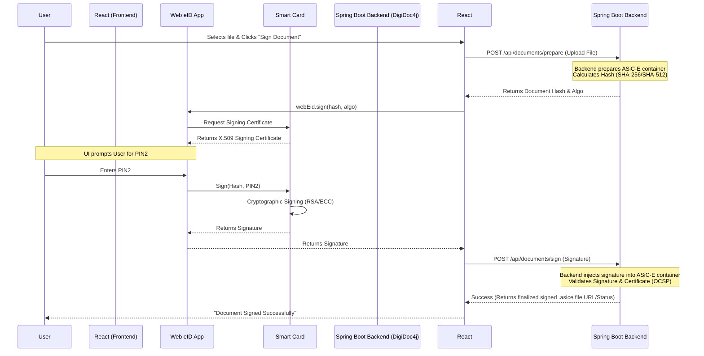

# Document Signing Workflow

## Overview
Document signing with Web eID is a multi-step process that involves the frontend, the backend, the native Web eID application, and the smart card.

Crucially, **the entire document is NOT sent to the smart card**. Instead, the backend (using a library like `DigiDoc4j`) calculates a cryptographic hash (digest) of the document. Only this hash is sent to the smart card to be signed. This ensures the process is fast and secure, regardless of the document's size.

The resulting signature is packaged into a standard container format, typically **ASiC-E** (Associated Signature Containers Extended) or **BDOC** (the Estonian national profile of ASiC-E). These formats comply with the eIDAS regulation for Advanced or Qualified Electronic Signatures (AdES / QES).

## Sequence Diagram

## Step-by-Step Details

1.  **Document Preparation (Backend)**: The user initiates signing. The document to be signed resides on the backend (or is uploaded in the first step). The backend uses `DigiDoc4j` to initialize a signature container (ASiC-E). It calculates the hash of the document(s) to be signed using a strong algorithm (e.g., SHA-256 or SHA-512).
2.  **Request Signature (Frontend -> Native App)**: The backend sends this calculated hash and the signing algorithm down to the React frontend. The frontend calls `webEid.sign()`, passing the hash.
3.  **Certificate Selection**: The native Web eID app connects to the smart card and retrieves the user's *signing* certificate. (Note: eID cards typically have separate certificates and keys for Authentication vs. Signing).
4.  **PIN Entry**: The native app prompts the user for PIN2 (the signing PIN, which is different from the authentication PIN).
5.  **Cryptographic Signature**: The native app sends the hash and PIN2 to the smart card. The smart card performs the actual cryptographic signature operation using the hardware-protected signing private key.
6.  **Signature Return**: The smart card returns the raw signature to the native app, which passes it back to the frontend, which then forwards it to the backend.
7.  **Container Finalization (Backend)**: The backend receives the raw signature. `DigiDoc4j` injects this signature into the ASiC-E container.
8.  **Validation**: `DigiDoc4j` performs a full validation of the newly created signature. This includes:
    *   Verifying the signature mathematically against the signing certificate's public key.
    *   Validating the signing certificate's trust chain.
    *   Fetching an OCSP response to ensure the certificate was valid at the exact moment of signing. This OCSP response is embedded *inside* the ASiC-E container (making it a long-term verifiable signature - XAdES-T or higher).
9.  **Completion**: The backend saves the finalized `.asice` or `.bdoc` file. The frontend is notified, and the user can download the legally binding signed document.

### Technologies Used for Signing
*   **Hash Algorithms**: SHA-256, SHA-384, SHA-512 (SHA-1 is obsolete and rejected).
*   **Signature Algorithms**: RSA (e.g., RSASSA-PKCS1-v1_5 or RSA-PSS) or ECDSA, depending on the specific eID card's hardware capabilities.
*   **Container Format**: ASiC-E (Associated Signature Containers Extended) - an EN 319 162 standard zip container holding the documents and XML signatures.
*   **Signature Standard**: XAdES (XML Advanced Electronic Signatures) is used within the ASiC container.

### References
*   [Web eID Document Signing Protocol](https://github.com/web-eid/web-eid-system-architecture-doc#digital-signing)
*   [DigiDoc4j Library](https://github.com/open-eid/digidoc4j)
