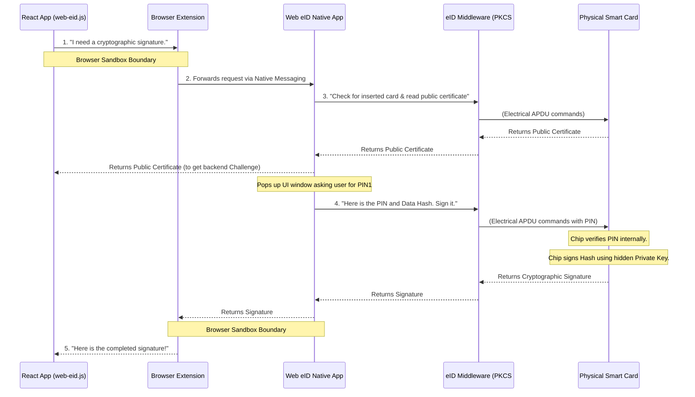

# Web eID Hardware Stack & Workflow

This document explains the different software components installed on the user's computer that make Web eID possible, and how they interact to securely access the physical smart card.

## 1. Why are these components needed?

Modern web browsers are highly secure sandboxes. They intentionally prevent websites (JavaScript) from directly accessing your computer's USB ports, file system, or attached hardware (like a smart card reader) to prevent malicious websites from stealing data. 

To bridge the gap between a web application (like our React frontend) and a physical piece of hardware (the smart card), the system requires a chain of trusted software components.

## 2. The Components (Top to Bottom)

### Level 1: The Browser Extension (The Bridge)
*   **Where it runs:** Inside the browser (Chrome, Firefox, Safari, Edge).
*   **Role:** It acts purely as a secure message broker. It listens for authentication or signing requests coming from the web page's JavaScript (via `web-eid.js`).
*   **Mechanism:** Because it is an extension, it has the special ability to use a browser API called **Native Messaging**, which allows it to pass messages *out* of the browser sandbox to a specific application on the operating system.

### Level 2: The Web eID Native App (The Coordinator)
*   **Where it runs:** On the operating system (e.g., `/Applications/Web eID.app` on macOS, or as a background `.exe` on Windows).
*   **Role:** It receives the request from the browser extension and manages the workflow. It is a desktop application, so it has the OS-level permissions required to draw UI windows and talk to hardware drivers.
*   **Mechanism:** It pops up the system dialog box asking the user to type in their PIN code. Once the PIN is entered, it asks the layer below it to perform the cryptography.

### Level 3: eID Middleware / PKCS#11 (The Hardware Translators)
*   **Where it runs:** Deep in the operating system, installed as part of the national ID software package (e.g., OpenSC, or country-specific middleware).
*   **Role:** A collection of low-level cryptographic libraries.
*   **Mechanism:** It translates standard programming commands into **APDU** (Application Protocol Data Unit) commands—the raw electrical language that the physical microchip on the smart card understands. It abstracts away the complex hardware details so the Native App doesn't have to know how the physical card was manufactured.

### Level 4: PC/SC Daemon & Drivers
*   **Where it runs:** Background OS service (e.g., `pcscd` on macOS/Linux, Smart Card service on Windows).
*   **Role:** The lowest level software driver that manages the physical USB connection to the smart card reader.

### Level 5: The Physical Hardware
*   **Smart Card Reader:** Provides power to the smart card chip and acts as the USB-to-chip data bridge.
*   **Smart Card (eID):** A secure microcomputer. It receives the APDU commands containing the PIN and the data hash. **Crucially, the private key never leaves this chip.** The chip verifies the PIN internally, performs the mathematical signing using its protected private key, and returns the signature.

---

## 3. Workflow: The Chain of Command

When a user clicks "Login with eID" in the React app, the following exact sequence occurs:

## Summary
If any link in this chain is missing or broken (e.g., the extension is disabled, the Native App isn't installed, the middleware drivers are outdated, or the card reader is unplugged), the authentication process will fail.
